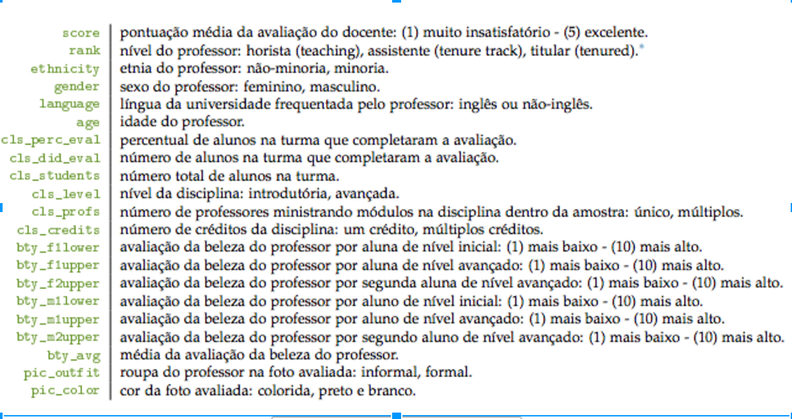

```{r setup, include=FALSE}
knitr::opts_chunk$set(echo = TRUE)
library(tidyverse)
```

## Relação entre beleza pessoal e competência profissional
Os dados analisados nesta atividade foram obtidos a partir de um estudo realizado na Universidade do Texas em Austin. O objetivo do estudo foi verificar o efeito da beleza de um professor sobre a percepção de sua capacidade profissional por parte dos alunos.

## Dados disponíveis
Neste estudo foram levantadas diversos dados sobre o professores e sobre as turmas, conforme imagem seguinte:



## Lendo os dados

```{r}
evals = read_csv("../data/evals.csv")
glimpse(evals)
```

```{r}
evals %>% 
  ggplot(aes(x = score)) +
  geom_density()

evals %>%
  ggplot(aes(x = gender)) +
  geom_boxplot(aes(y = score))
```